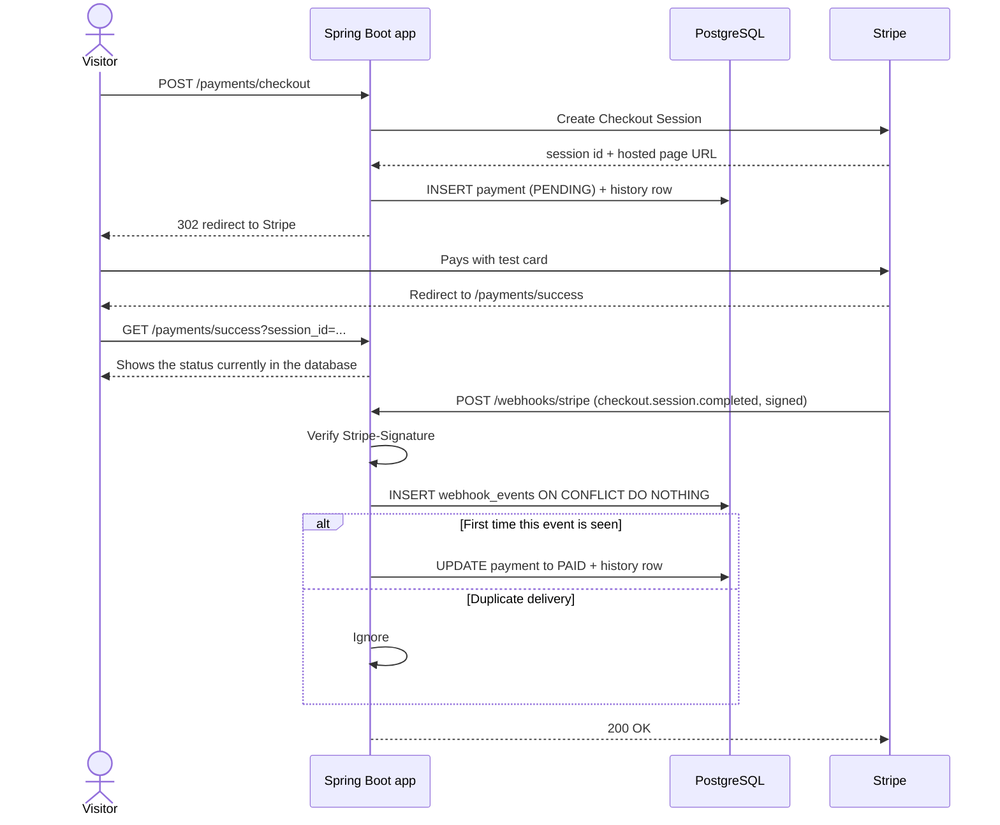
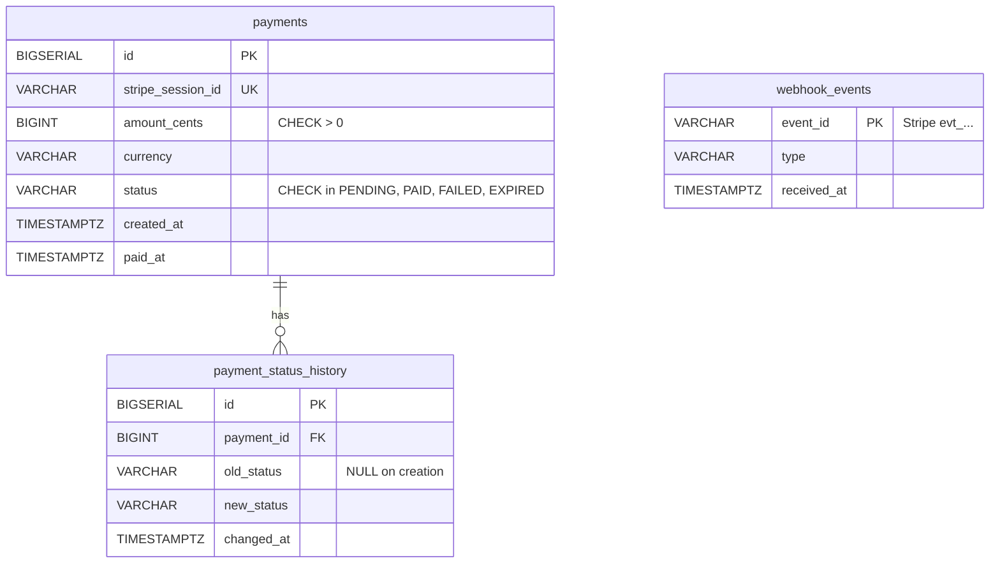

# Personal Page + Stripe Payments Demo


My personal website, built with Spring Boot and Thymeleaf, with a **working payment flow in Stripe test mode** and an **admin dashboard** on top of it.

The goal of the payment demo is not to sell anything. It shows how I handle the parts of a payment system that are easy to get wrong: trusting webhooks instead of redirects, processing each event exactly once, keeping an audit trail, and letting the database enforce the rules that matter.

> **Test mode only.** No real money moves. The application refuses to start with a live Stripe key.
> Use the test card `4242 4242 4242 4242`, any future expiry date and any CVC.

**Live demo:** _coming soon_

---

## Contents

- [What it demonstrates](#what-it-demonstrates)
- [Tech stack](#tech-stack)
- [How a payment flows](#how-a-payment-flows)
- [Data model](#data-model)
- [Design decisions](#design-decisions)
- [Endpoints](#endpoints)
- [Project structure](#project-structure)
- [Running locally](#running-locally)
- [Running the tests](#running-the-tests)
- [Environment variables](#environment-variables)
- [What I would add for production](#what-i-would-add-for-production)
- [License](#license)

---

## What it demonstrates

| Area | What is implemented |
|---|---|
| **Payments** | Stripe Checkout Session, signed webhook, payment status lifecycle (`PENDING` → `PAID`) |
| **Reliability** | Idempotent webhook processing that survives duplicate and concurrent deliveries |
| **Data integrity** | `CHECK`, `UNIQUE` and `FOREIGN KEY` constraints, versioned migrations with Flyway |
| **Auditing** | Every status change is recorded in a history table, including a backfill for existing rows |
| **Reporting** | Admin dashboard with totals by status, revenue per day and conversion rate |
| **Security** | Login-protected admin area, CSRF protection, secrets only in environment variables |
| **Testing** | Integration tests against a real PostgreSQL started by Testcontainers |

---

## Tech stack

| Layer | Technology |
|---|---|
| Language | Java 17 |
| Framework | Spring Boot 4.1 (Web MVC, Data JPA, Security) |
| Views | Thymeleaf, plain CSS and JavaScript |
| Database | PostgreSQL 16 (Docker Compose for local development) |
| Migrations | Flyway |
| Payments | Stripe Java SDK, Stripe Checkout, Stripe CLI for local webhooks |
| Testing | JUnit 5, AssertJ, Testcontainers |
| Build | Maven (wrapper included) |

---

## How a payment flows



The **success page only shows what the database says**. If the webhook has not arrived yet, the visitor sees "Payment pending" and can refresh. The redirect from Stripe never marks a payment as paid, because anyone can open that URL.

---

## Data model



| Migration | What it does |
|---|---|
| `V1__create_payments.sql` | `payments` table with integrity rules and indexes on `status` and `created_at` (used by the reports) |
| `V2__create_webhook_events.sql` | `webhook_events` table, the basis of idempotency |
| `V3__create_payment_status_history.sql` | Audit table, plus a backfill that rebuilds the history of payments created before it existed |

Hibernate runs with `ddl-auto: validate`: **Flyway owns the schema**, and Hibernate only checks that the entities match it.

---

## Design decisions

### 1. The webhook is the source of truth

A payment becomes `PAID` only when Stripe sends `checkout.session.completed` to `/webhooks/stripe` **and** the `Stripe-Signature` header is valid. The redirect to the success page is treated as untrusted user navigation.

### 2. Idempotent webhook processing

Stripe delivers events **at least once**, so the same event can arrive twice, sometimes at the same moment. Checking `if status == PAID` is not enough: two concurrent requests can both read `PENDING`.

Each event id is recorded in `webhook_events`, whose primary key is the Stripe event id:

```sql
INSERT INTO webhook_events (event_id, type)
VALUES (:eventId, :type)
ON CONFLICT (event_id) DO NOTHING
```

- It is **one atomic statement**, not "select, then insert", so there is no race window.
- The affected row count tells the service whether the event is new (`1`) or a duplicate (`0`).
- Recording the event and updating the payment happen in **the same transaction**. If the update fails, the event record is rolled back too, and Stripe's retry gets processed normally.
- Duplicates still get `200 OK`, so Stripe stops retrying.

### 3. Audit trail enforced by the domain model

Every status change goes through a single private method of the `Payment` entity:

```java
private void changeStatus(PaymentStatus newStatus) {
    statusHistory.add(new PaymentStatusHistory(this, this.status, newStatus));
    this.status = newStatus;
}
```

- **No code path can change the status without writing history.** The rule lives in the entity, not in a service that someone could forget to call.
- `PaymentStatusHistory` has a package-private constructor, so only the `model` package can create history rows.
- The getter returns an immutable copy of the list, so callers cannot add or remove history entries.
- Migration `V3` backfills the history of payments that existed before the table was created.

### 4. The database is the last line of defense

The Java code validates input, but the important rules are also constraints in PostgreSQL: positive amounts, a fixed set of statuses, unique Stripe sessions and foreign keys. The tests write invalid rows **with plain SQL**, bypassing Java entirely, to prove the database alone rejects them.

### 5. Money and time

- Amounts are stored as **integer cents** (`BIGINT`), never as floating point.
- Timestamps are stored as `TIMESTAMPTZ` (UTC) and converted to `Europe/Madrid` only for display and for grouping by day, so a payment at 00:30 in Madrid is counted on the right day.

### 6. Reporting queries

- **Totals by status** use JPQL with a constructor expression that maps rows straight into a Java `record`. Portable across databases.
- **Revenue per day** uses native SQL to take advantage of PostgreSQL features: `AT TIME ZONE` for correct day boundaries and `COUNT(*) FILTER (WHERE ...)` to count created and paid checkouts in a single pass.
- The admin service runs in a `readOnly` transaction.

### 7. Security

- `/admin/**` requires the `ADMIN` role. Everything else (personal page, checkout, success page) is public.
- CSRF protection is on for every form. Thymeleaf's `th:action` injects the token automatically.
- `/webhooks/stripe` is the **only** endpoint exempt from CSRF, because Stripe cannot send a token. It is protected by signature verification instead, and a test proves both: the request is not blocked by CSRF, and a forged signature is still rejected with `400`.
- The admin password comes from an environment variable with **no default value**, so the app fails to start instead of running with a known password. It is kept in memory as a BCrypt hash.
- All secrets are read from environment variables. Nothing sensitive is committed.
- `StripeConfig` refuses to start unless the key begins with `sk_test_`.

---

## Endpoints

| Method | Path | Access | Description |
|---|---|---|---|
| `GET` | `/` | Public | Personal page with the payment demo |
| `POST` | `/payments/checkout` | Public (CSRF token required) | Creates a Stripe Checkout Session and redirects to it |
| `GET` | `/payments/success?session_id=...` | Public | Shows the payment status stored in the database |
| `POST` | `/webhooks/stripe` | Stripe only (signature verified) | Receives `checkout.session.completed` |
| `GET` | `/admin` | `ADMIN` | Dashboard. Optional filter: `?status=PAID` |
| `GET` / `POST` | `/login` | Public | Login form |
| `POST` | `/logout` | Authenticated | Ends the session |

---

## Project structure

```
src/
├── main/
│   ├── java/com/personal/page/
│   │   ├── config/        StripeConfig, SecurityConfig
│   │   ├── controller/    HomeController, PaymentController, WebhookController, AdminController
│   │   ├── dto/           Records and projections sent to the views
│   │   ├── model/         Payment, PaymentStatus, PaymentStatusHistory, WebhookEvent
│   │   ├── repository/    Spring Data repositories and reporting queries
│   │   └── service/       PaymentService, AdminService
│   └── resources/
│       ├── db/migration/  Flyway migrations V1 to V3
│       ├── static/        CSS, JavaScript, images
│       ├── templates/     index, success, admin
│       └── application.yaml
└── test/java/com/personal/page/
    ├── IntegrationTestBase.java   Shared Spring context + PostgreSQL container
    ├── PaymentServiceTest.java    Idempotency and database constraints
    ├── SecurityTest.java          Access rules, CSRF and webhook signature
    └── PageApplicationTests.java  Context loads
```

---

## Running locally

### Prerequisites

- JDK 17 or newer
- Docker Desktop
- [Stripe CLI](https://docs.stripe.com/stripe-cli) and a Stripe account (test mode is free)

### 1. Start the database

```bash
docker compose up -d
```

This starts PostgreSQL 16 on `localhost:5432` with database `page`, user `postgres` and password `dev` (or the value of `DB_PASSWORD`). Flyway creates the tables when the app starts.

### 2. Forward Stripe webhooks to your machine

Stripe cannot reach `localhost`, so the CLI forwards the events:

```bash
stripe login
stripe listen --events checkout.session.completed --forward-to localhost:8080/webhooks/stripe
```

Copy the `whsec_...` secret it prints and keep this terminal open.

### 3. Set the environment variables

PowerShell:

```powershell
$env:DB_PASSWORD = "dev"
$env:STRIPE_SECRET_KEY = "sk_test_..."        # Stripe dashboard > Developers > API keys
$env:STRIPE_WEBHOOK_SECRET = "whsec_..."      # printed by stripe listen
$env:ADMIN_PASSWORD = "choose-a-strong-password"
```

Bash:

```bash
export DB_PASSWORD=dev
export STRIPE_SECRET_KEY=sk_test_...
export STRIPE_WEBHOOK_SECRET=whsec_...
export ADMIN_PASSWORD=choose-a-strong-password
```

### 4. Run the application

```bash
./mvnw spring-boot:run        # Windows: .\mvnw.cmd spring-boot:run
```

- Site: <http://localhost:8080>
- Admin: <http://localhost:8080/admin> (user `admin`, password from `ADMIN_PASSWORD`)

### 5. Make a test payment

Click the pay button and use card `4242 4242 4242 4242`, any future date, any CVC. The `stripe listen` terminal should show `[200] POST .../webhooks/stripe`, and the success page should say **Payment received**.

To see idempotency in action, resend the same event:

```bash
stripe events resend evt_...
```

The app answers `200` again and logs `already processed, ignoring`, and the database still has a single row for that event.

### Inspecting the database

```bash
docker exec -it page-db psql -U postgres -d page
```

```sql
SELECT id, status, amount_cents, created_at, paid_at FROM payments ORDER BY created_at DESC;
SELECT * FROM payment_status_history ORDER BY payment_id, changed_at;
SELECT * FROM webhook_events ORDER BY received_at DESC;
```

---

## Running the tests

Docker must be running. Testcontainers starts a temporary `postgres:16` container, Flyway applies all migrations to it, and the container is removed when the tests finish. Your local database is never touched, and no real Stripe keys are needed.

```bash
./mvnw test        # Windows: .\mvnw.cmd test
```

| Test | What it proves |
|---|---|
| `duplicateWebhookEventIsProcessedOnlyOnce` | The same event delivered twice creates one `webhook_events` row and exactly two history rows |
| `databaseRejectsNegativeAmount` | The `CHECK` constraint rejects a negative amount written with plain SQL |
| `databaseRejectsUnknownStatus` | The `CHECK` constraint rejects a status outside the allowed set |
| `adminRedirectsToLoginWhenAnonymous` | `/admin` without a session redirects to `/login` |
| `webhookSkipsCsrfButStillVerifiesSignature` | The webhook is not blocked by CSRF (`403`), and a forged signature is rejected (`400`) |
| `checkoutWithoutCsrfTokenIsRejected` | Forms without a CSRF token are refused |
| `contextLoads` | The full application context starts against a fresh database |

The tests are **integration tests**: they run the real Spring context, real HTTP requests and a real PostgreSQL, because the behavior that matters most here (`ON CONFLICT`, constraints, migrations, security filters) cannot be proven with mocks.

---

## Environment variables

| Variable | Required | Default | Description |
|---|---|---|---|
| `DB_PASSWORD` | Yes | – | PostgreSQL password (`dev` with the provided Docker Compose file) |
| `STRIPE_SECRET_KEY` | Yes | – | Stripe secret key. Must start with `sk_test_` |
| `STRIPE_WEBHOOK_SECRET` | Yes | – | Webhook signing secret (`whsec_...`) |
| `ADMIN_PASSWORD` | Yes | – | Admin password. No default on purpose |
| `ADMIN_USERNAME` | No | `admin` | Admin username |
| `APP_BASE_URL` | No | `http://localhost:8080` | Public URL used to build Stripe's return URLs |

---

## What I would add for production

- **Expired checkouts:** handle `checkout.session.expired` to move abandoned payments from `PENDING` to `EXPIRED`. The status is already allowed by the schema.
- **Managed database:** Amazon RDS with automated backups instead of PostgreSQL in Docker.
- **Refunds and failures:** handle `charge.refunded` and failed payments, with their own statuses and history.
- **CI:** a GitHub Actions workflow that runs the test suite on every push.
- **Observability:** structured logs and metrics for webhook latency and failures.
- **Rate limiting** on the checkout endpoint.

---

## License

The source code is released under the [MIT License](LICENSE).

My resume and photo in `src/main/resources/static/` are personal content and are **not** covered by the license.
